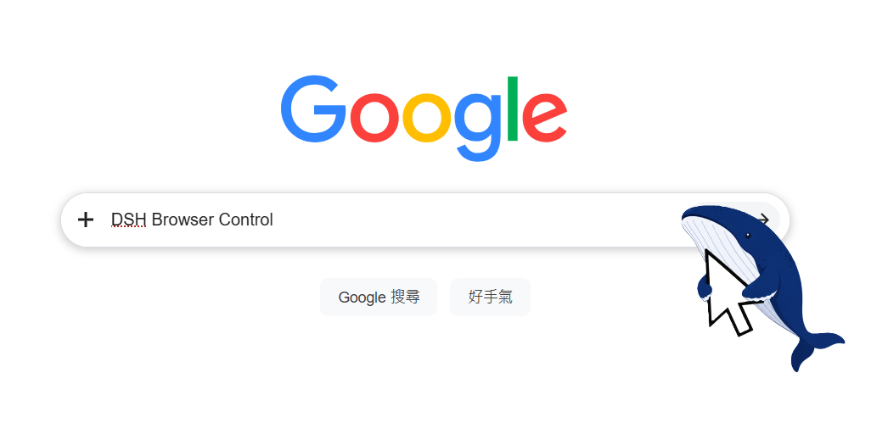

# DSH Browser Control

<p align="center">
  
</p>

<p align="center">
  <a href="README.md">简体中文</a> · <a href="README.en.md">English</a>
</p>

<p align="center">
  <a href="https://github.com/caob23/dsh-browser-control/releases"></a>
  <a href="https://github.com/caob23/dsh-browser-control/blob/main/LICENSE"></a>
  <a href="https://awesome-dsh-plugin.com"></a>
  <a href="https://developer.chrome.com/docs/extensions/develop/migrate/mv2-deprecation-timeline"></a>
  <a href="https://github.com/topics/dsh-plugin"></a>
  
  
  
</p>

A Chrome extension + DeepSeek Harness plugin that lets AI agents drive your real browser like a human.

<p align="center">
  
</p>

## What is this

Not a headless browser, not Puppeteer — your **real Chrome**, with your logins and cookies. The AI drives tabs through the Chrome DevTools Protocol while you watch every step on screen.

```
You say one sentence to the AI
      ↓
Agent calls browser_* tools
      ↓
DSH plugin (WebSocket bridge)
      ↓
Chrome extension (CDP)
      ↓
Your real browser performs the action
      ↓
Result returns to the Agent
```

## How it differs from MCP browser solutions

Browsers via MCP (Playwright MCP, Puppeteer MCP, browser-use…) share one trait: they launch a **fresh browser instance they downloaded themselves**. This project takes the other road:

| | This project | Playwright / Puppeteer MCP |
|---|---|---|
| Browser | The real Chrome you are using | Separate auto-downloaded instance |
| Logins / Cookies | ✅ Fully inherited, no re-login | ❌ Fresh profile every time |
| CAPTCHAs / QR login | Rarely hit — your sessions stay logged in | Frequently stuck at login walls |
| Visibility | Live on your screen, grab the mouse anytime | Headless or separate window |
| Environment deps | No Node / npx / Python needed | Needs npx or uvx runtime |
| Setup | Load extension + settings toggle | Edit MCP client JSON config |
| Disk usage | Reuses existing Chrome, zero extra | Downloads hundreds of MB |
| Integration depth | Native dsh plugin (settings card / status page / cleanup button) | Generic MCP server |

In one line: **for "use MY browser" tasks (logged-in Bilibili, Zhihu, admin panels), use this project; for generic cross-browser test automation, use MCP.**

## Download

| File | Purpose |
|---|---|
| [DSH-Browser-Control-1.0.7.zip](https://github.com/caob23/dsh-browser-control/releases/download/v1.0.7/DSH-Browser-Control-1.0.7.zip) | Chrome extension (unzip and load) |
| [dsh-browser-control-plugin-v1.0.7.zip](https://github.com/caob23/dsh-browser-control/releases/download/v1.0.7/dsh-browser-control-plugin-v1.0.7.zip) | dsh plugin (offline fallback; online installs use Option A/B) |

## Install the Chrome extension (30 seconds)

Download the zip → unzip to a fixed folder (don't delete it) → open `chrome://extensions` → enable Developer mode → click "Load unpacked" → pick the unzipped folder.

Whale icon in the toolbar = success. Requires Chrome 116+.

## Install the dsh plugin

📦 This package is a bundle (`package.json` points `dsh.bundle.patch` at `cordis.patch.yml`). A successful `dsh plugin add` registers it under the profile's `dsh.profile.bundles`; a restart loads it.

Prerequisite: `dsh plugin` forwards to pnpm, so pnpm must be on PATH; the target profile is initialized automatically on first use.

### Option A: install from npm (recommended)

```bash
# Install from the npm registry and register it with the profile
dsh plugin --profile web add @caob23/dsh-browser-control
```

If you manage the profile's node_modules yourself, plain npm works there too:

```bash
npm install @caob23/dsh-browser-control
```

### Option B: install from GitHub or a local directory

```bash
# Straight from GitHub
dsh plugin --profile web add "github:caob23/dsh-browser-control#v1.0.7"

# Local checkout for debugging (note: the explicit file: prefix is required)
dsh plugin --profile web add "file:D:\path\to\dsh-browser-control"
```

Restart DSH to load it. Uninstall:

```bash
dsh plugin --profile web remove @caob23/dsh-browser-control
```

> ⚠️ Always use the `file:` prefix for local directories. Bare / relative paths
> are treated as the `link:` protocol by pnpm, which does not materialize into
> node_modules top-level under hoisted layouts and fails to resolve at boot.

After installing and restarting, the bridge is on by default (v1.0.6+); no manual enable step. The status page at http://127.0.0.1:9777/ confirms the listener is up.

> To opt out: set `enabled: false` under `browser-bridge.config` in `~/.dsh/settings.yml`.

### Option C: copy into the harness tree (legacy, v1.0.2 and earlier)

```bash
git clone https://github.com/caob23/dsh-browser-control.git
cd dsh-browser-control
git checkout v1.0.2   # legacy layout lives at the v1.0.2 tag
./install.sh /path/to/deepseek-harness
```

The script only copies plugin files into place — **you still need the three manual config edits**, then restart dsh:

Download [`dsh-browser-bridge-plugin-v1.0.2.zip`](https://github.com/caob23/dsh-browser-control/releases/download/v1.0.2/dsh-browser-bridge-plugin-v1.0.2.zip) and unzip into `deepseek-harness/packages/web/browser-bridge/`.

Then add three pieces of config:

1. In `packages/bundle/base/package.json` dependencies:

```json
"@deepseek-ai/dsh-browser-bridge": "workspace:^"
```

2. In `cordis.patch.yml` plugins list:

```yaml
- id: browser-bridge
  name: '@deepseek-ai/dsh-browser-bridge'
  config:
    enabled: false
```

3. In `tsconfig.host.json` references:

```json
{ "path": "./packages/web/browser-bridge" }
```

Restart dsh → the "DSH Browser Control" card appears in Settings → enable it. Details in [dsh-config/README.md](dsh-config/README.md).

## Usage

1. dsh Settings → Plugins → DSH Browser Control → enable
2. The extension connects automatically (port 9777, default token dsh-local)
3. Talk in natural language; the agent drives the browser

Visit `http://127.0.0.1:9777/` for connection status.

## Tools

| Tool | Purpose |
|---|---|
| `browser_navigate` | Navigate to a URL |
| `browser_read` | Read page text/HTML |
| `browser_snapshot` | Page snapshot → ref interaction tree |
| `browser_click` | Click an element (by ref / selector) |
| `browser_type` | Type into inputs |
| `browser_press` | Send keyboard keys |
| `browser_scroll` | Scroll the page |
| `browser_tabs` | Tab management (list/open/close/activate) |
| `browser_evaluate` | Run arbitrary JS |
| `browser_screenshot` | Capture page screenshot |
| `browser_console_log` | Captured page console entries (v1.0.7+) |
| `browser_network_log` | Captured HTTP request/response log (v1.0.7+) |
| `browser_pdf` | Export the current page as PDF (v1.0.7+) |
| `browser_emulate` | Switch to a device viewport (mobile / desktop / custom, v1.0.7+) |
| `browser_cleanup` | Clean up temp files |

## Architecture

```
Chrome browser
  └─ DSH Browser Control extension (MV3)
       └─ chrome.debugger (CDP)
            └─ WebSocket ──────→ DSH plugin (browser-bridge)
                                      └─ browser_* tools → Agent
```

**Key design:**
- Extension dials out to the bridge (no native messaging host)
- Off by default; enabled manually from Settings
- Persistent debugger attachment — banner stays visible during control
- Listens on 127.0.0.1 only, token-authenticated

## Verified

| Scenario | Result |
|---|---|
| Baidu search → extract result titles | ✅ |
| Bilibili user search → send DM | ✅ |
| Bilibili search → count video cards + screenshot | ✅ |
| Unit tests 29/29 | ✅ |
| Type checks (host + client) | ✅ |

## Changelog

See [CHANGELOG.md](CHANGELOG.md).

## License

This project is licensed under the **GNU Affero General Public License v3.0 (AGPL-3.0)**.

- **Personal / academic / non-commercial use**: completely free — use, modify, and distribute freely under AGPL-3.0 terms
- **Enterprise / commercial use**: AGPL-3.0 treats networked use as distribution, requiring derivative code to be published. If you want to embed this project in closed-source products or build a SaaS on it without open-sourcing, contact the author for a **commercial license** (terms negotiated separately)
- **Commercial licensing inquiries**: [GitHub Issues](https://github.com/caob23/dsh-browser-control/issues) or email **caob2333@outlook.com**

See the [LICENSE](LICENSE) file for the full license text (AGPL-3.0).
